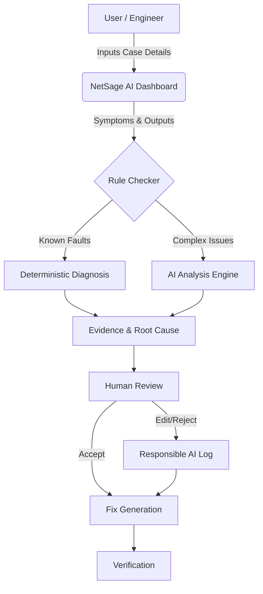

**NetSage AI** is an AI-powered network troubleshooting assistant designed specifically for Cisco Packet Tracer and networking lab environments. It empowers junior network engineers to efficiently identify root causes of network issues by intelligently analyzing user-described symptoms, topology notes, and Cisco CLI `show` command outputs.

---

## 🏗️ Architecture Workflow

NetSage AI bridges the gap between deterministic network validation and AI-driven insights through a robust human-in-the-loop workflow.



## ✨ Key Features

- 🧠 **AI-Powered Diagnosis**: Analyzes raw command output and contextual symptoms to provide an evidence-backed root cause, a confidence score, and actionable remediation steps.
- 🔍 **Deterministic Rule Checker**: A fast, deterministic Python engine (`checker.py`) that acts as a first line of defense, catching common faults (e.g., duplicate IP addresses, downed interfaces, missing VLANs) before invoking the AI.
- 🧑‍💻 **Human-in-the-Loop Workflow**: Ensures safety and accuracy. All AI recommendations MUST be reviewed by a human expert. The system seamlessly supports accepting, editing, or rejecting AI diagnoses.
- 📈 **Responsible AI Logging**: Tracks all human corrections made to AI diagnoses. This critical feedback loop is used to continuously improve and fine-tune the model over time.
- 📚 **Extensive Case Library**: Ships pre-loaded with over 30 realistic, challenging networking troubleshooting scenarios to test and train on.

## 🚀 Getting Started

Follow these instructions to get a copy of the project up and running on your local machine for development and testing purposes.

### Prerequisites

Ensure you have the following installed:
- [Node.js](https://nodejs.org/) (v18 or higher)
- [Python](https://www.python.org/) (3.9 or higher)

### 💻 Frontend Setup (Dashboard)

The frontend is built with React, Vite, and Tailwind CSS.

```bash
# Navigate to the frontend directory
cd frontend

# Install dependencies
npm install

# Start the development server
npm run dev
```
The dashboard will typically be available at `http://localhost:5173`.

### ⚙️ Backend Setup (API)

The backend is a robust REST API built with FastAPI.

```bash
# Navigate to the backend directory
cd backend

# (Optional but recommended) Create and activate a virtual environment
python -m venv venv
# On Windows: venv\Scripts\activate
# On macOS/Linux: source venv/bin/activate

# Install the required Python packages
pip install fastapi uvicorn

# Start the FastAPI server with live reload
uvicorn main:app --reload
```
The API will be available at `http://localhost:8000`. You can view the interactive API documentation at `http://localhost:8000/docs`.

---

## 🤝 Contributing

Contributions are what make the open-source community such an amazing place to learn, inspire, and create. Any contributions you make are **greatly appreciated**.

Made with ❤️ by Shourya Kumar.
